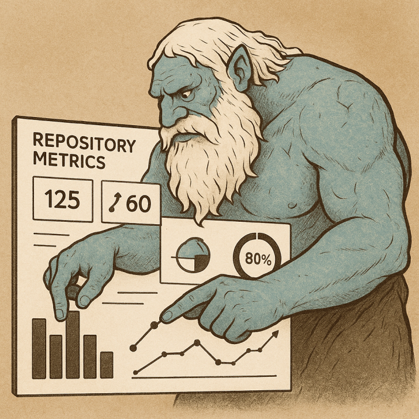

<h1 align="center">IMIR</h1>

  <blockquote><em>Infra Metrics Insight Renderer</em></blockquote>

  

  

  This repository hosts reusable GitHub Actions workflows for rendering
  <a href="https://github.com/lowlighter/metrics">lowlighter/metrics</a>
  dashboards used across RAprogramm projects.

  <strong>IMIR exists to take the friction out of README polish.</strong>
  Point your repository at the provided workflows, merge the generated
  <code>metrics/&lt;slug&gt;.svg</code> badge, and drop a one-line embed into
  your README: GitHub instantly shows a fully styled metrics card and IMIR keeps
  it refreshed automatically. No custom infrastructure, no hand-crafted SVGs,
  just copy the badge URL and ship.

<h2>Table of contents</h2>
<ul>
  <li><a href="#repository-metrics-workflow">Repository metrics workflow</a>
    <ul>
      <li><a href="#open-source-repositories-bundle">Open-source repositories bundle</a></li>
    </ul>
  </li>
  <li><a href="#unified-target-configuration">Unified target configuration</a></li>
  <li><a href="#imir-badge-integration">IMIR badge integration</a>
    <ul>
      <li><a href="#badge-catalogue">Badge catalogue</a>
        <ul>
          <li><a href="#open-source-badges">🟩 Open-source badges</a></li>
          <li><a href="#private-project-badges">🟦 Private project badges</a></li>
          <li><a href="#profile-badges">🟪 Profile badges</a></li>
          <li><a href="#color-reference">Color reference</a></li>
        </ul>
      </li>
    </ul>
  </li>
  <li><a href="#imir-cli">IMIR CLI</a></li>
  <li><a href="#local-development-workflow">Local development workflow</a></li>
  <li><a href="#release-process">Release process</a></li>
</ul>

<em><a href="#top">Back to top</a></em>

<h2 align="center" id="repository-metrics-workflow">Repository metrics workflow</h2>

  Use <code>.github/workflows/render-repository.yml</code> to refresh repository dashboards based on the "repository" template. Supply the
  repository handle and optional overrides for the owner, target branch name, artifact filename, or destination path.

<pre><code class="language-yaml">jobs:
  example:
    uses: RAprogramm/infra-metrics-insight-renderer/.github/workflows/render-repository.yml@main
    with:
      target_repo: my-repository
      # branch_name: ci/metrics-refresh-my-repository
      # contributors_branch: main
      # target_owner: RAprogramm
      # target_path: metrics/my-repository.svg
      # temp_artifact: .metrics-tmp/my-repository.svg
    secrets:
      CLASSIC: ${{ secrets.METRICS_TOKEN }}</code></pre>

  The workflow automatically renders the repository metrics card, commits the refreshed SVG to the configured path, and opens an
  idempotent pull request when changes are detected.

<em><a href="#top">Back to top</a></em>

<h3 align="center" id="open-source-repositories-bundle">Open-source repositories bundle</h3>

  Workflows targeting public repositories that live under the <code>RAprogramm</code> organization can reuse
  <code>.github/workflows/render-open-source.yml</code>. The workflow accepts a JSON array with repository names and renders the standard repository dashboard for each entry. The list is validated through the <code>imir open-source</code> subcommand, ensuring the matrix only includes non-empty repository names.

<pre><code class="language-yaml">jobs:
  open_source:
    uses: RAprogramm/infra-metrics-insight-renderer/.github/workflows/render-open-source.yml@main
    with:
      repositories: '["masterror", "telegram-webapp-sdk"]'
    secrets:
      CLASSIC: ${{ secrets.METRICS_TOKEN }}</code></pre>

  Providing a custom list of repositories allows a single job to refresh multiple metrics cards without duplicating boilerplate workflow definitions.

<em><a href="#top">Back to top</a></em>

<h2 align="center" id="unified-target-configuration">Unified target configuration</h2>

  The <a href="targets/targets.yaml"><code>targets/targets.yaml</code></a> file defines every metrics target that should be refreshed on the regular
  schedule. Each entry requires the GitHub account (<code>owner</code>), an optional <code>repository</code>, and the <code>type</code> of metrics card to render:

<ul>
  <li><code>profile</code> – render a classic GitHub profile card.</li>
  <li><code>open_source</code> – render the repository template for public projects.</li>
  <li><code>private_project</code> – render the repository template for private projects.</li>
</ul>

  When the scheduled <a href=".github/workflows/render-all.yml"><code>render-all.yml</code></a> workflow runs it executes the
  <code>imir</code> CLI to transform the YAML into a matrix consumed by the rendering jobs. New targets can be tested locally
  with:

<pre><code class="language-bash">cargo run --manifest-path imir/Cargo.toml -- --config targets/targets.yaml --pretty</code></pre>

  Use the open-source helper to normalize ad-hoc repository lists for the bundled workflow:

<pre><code class="language-bash">cargo run --manifest-path imir/Cargo.toml -- open-source --input '["masterror", "telegram-webapp-sdk"]'</code></pre>

  The command outputs the normalized JSON document that the workflow uses. The same CLI is invoked during CI, so validation errors
  must be resolved locally before a workflow run succeeds.

Optional per-target overrides include:

<ul>
  <li><code>branch_name</code> (or the alias <code>branch</code>) – select the Git branch used for the metrics refresh pull request.</li>
  <li><code>target_path</code> – change where the rendered SVG is stored.</li>
  <li><code>temp_artifact</code> – adjust the temporary filename produced by the renderer before moving it into place.</li>
  <li><code>contributors_branch</code> – specify the repository branch analyzed by the contributors plugin.</li>
  <li><code>time_zone</code> – customize the time zone passed to the renderer.</li>
  <li><code>slug</code> – override the derived slug used for filenames and workflow dispatch names.</li>
  <li><code>include_private</code> – set to <code>true</code> to include private repositories and secret achievements for the target.</li>
</ul>

  Unset overrides fall back to deterministic defaults chosen by the orchestrator, so adding a new target only requires the owner,
  repository (when applicable), and target type.

<em><a href="#top">Back to top</a></em>

<h2 align="center" id="imir-badge-integration">IMIR badge integration</h2>

  Register a repository or profile by adding a new entry to
  <a href="targets/targets.yaml"><code>targets/targets.yaml</code></a>. The orchestrator normalizes the identifier into a slug that becomes the SVG filename and forms the basis for badge embeds. Scheduled renders run on the cadence defined in the repository workflows, so dashboards refresh automatically once the target is listed.

  After the initial registration lands in <code>main</code>, trigger the on-demand workflow named <code>render-&lt;slug&gt;.yml</code> to produce the first
  badge artifact. This pre-populates the SVG before linking to it in documentation.

Embed the rendered badge in Markdown using the slugged artifact path:

<pre><code class="language-markdown"></code></pre>

  Replace <code>&lt;slug&gt;</code> with the normalized identifier emitted for the target (for example, <code>owner-repository</code> for repository cards or
  <code>owner</code> for profile cards). Once the slug exists under <code>metrics/</code>, the badge can be referenced from any README or documentation
  page.

<h3 align="center" id="badge-catalogue">Badge catalogue</h3>

  The published badges are grouped by color so their category is obvious at a glance. Reuse the badges directly from the
  repository to avoid stale snapshots.

<em><a href="#top">Back to top</a></em>

<h4 align="center" id="open-source-badges">🟩 Open-source badges</h4>

<table>
  <thead>
    <tr><th>Repository</th><th>Badge</th></tr>
  </thead>
  <tbody>
    <tr>
      <td><code>RAprogramm/masterror</code></td>
      <td></td>
    </tr>
    <tr>
      <td><code>RAprogramm/telegram-webapp-sdk</code></td>
      <td></td>
    </tr>
  </tbody>
</table>

<em><a href="#top">Back to top</a></em>

<h4 align="center" id="private-project-badges">🟦 Private project badges</h4>

  Private dashboards follow the same embedding rules. Publish badges from this section once private projects are registered.

<em><a href="#top">Back to top</a></em>

<h4 align="center" id="profile-badges">🟪 Profile badges</h4>

<table>
  <thead>
    <tr><th>Account</th><th>Badge</th></tr>
  </thead>
  <tbody>
    <tr>
      <td><code>RAprogramm</code></td>
      <td></td>
    </tr>
  </tbody>
</table>

<em><a href="#top">Back to top</a></em>

<h4 align="center" id="color-reference">Color reference</h4>
<ul>
  <li>🟩 Green badges indicate open-source repositories.</li>
  <li>🟦 Blue badges denote private repositories.</li>
  <li>🟪 Purple badges represent GitHub profile dashboards.</li>
</ul>

<em><a href="#top">Back to top</a></em>

<h2 align="center" id="imir-cli">IMIR CLI</h2>

  The <code>imir</code> crate lives in
  <a href="imir"><code>imir</code></a>. It validates the target configuration,
  applies deterministic defaults for filenames, branch names, and time zones, and serializes the normalized targets in JSON form.
  Unit tests cover slug normalization, configuration validation, and duplicate detection to ensure predictable behaviour when new
  targets are added.

<em><a href="#top">Back to top</a></em>

<h2 align="center" id="local-development-workflow">Local development workflow</h2>

  Use <a href="scripts/ci-check.sh"><code>scripts/ci-check.sh</code></a> to run the full validation pipeline locally. The helper script formats the code
  with the nightly toolchain, executes Clippy, builds all targets, runs tests, generates documentation, and invokes <a href="https://crates.io/crates/cargo-audit">cargo audit</a>
  and <a href="https://crates.io/crates/cargo-deny">cargo deny</a> to ensure dependency health. Install
  <a href="https://crates.io/crates/cargo-audit">cargo-audit</a> and <a href="https://crates.io/crates/cargo-deny">cargo-deny</a> beforehand to enable the security checks.

<em><a href="#top">Back to top</a></em>

<h2 align="center" id="release-process">Release process</h2>

  Tagged releases publish pre-built <code>imir</code> binaries so GitHub Actions workflows can download a pinned CLI without
  rebuilding the crate on every run. Follow this checklist to cut a new release:

<ol>
  <li>Run <a href="scripts/ci-check.sh"><code>scripts/ci-check.sh</code></a> locally to ensure formatting, linting, tests,
    documentation, <code>cargo audit</code>, and <code>cargo deny</code> all pass before tagging.</li>
  <li>Create an annotated tag (for example, <code>git tag -a v0.1.0</code>) and push it to GitHub.</li>
  <li>Draft a release in the GitHub UI, associate it with the tag, and publish it. Publishing triggers
    <code>.github/workflows/release.yml</code>.</li>
  <li>The workflow builds the CLI for Linux (<code>x86_64-unknown-linux-gnu</code>), macOS (<code>aarch64-apple-darwin</code>), and
    Windows (<code>x86_64-pc-windows-msvc</code>), packages the binaries as archives named
    <code>imir-&lt;target&gt;.tar.gz</code> or <code>imir-&lt;target&gt;.zip</code>, and uploads them to the release assets.</li>
  <li>Update downstream workflows to download the archive that matches their runner architecture and unpack the <code>imir</code>
    executable into their workspace.</li>
</ol>

  Each archive contains only the compiled binary. The release workflow runs on every published release, ensuring updated
  binaries are available immediately after a tag is promoted.

<em><a href="#top">Back to top</a></em>

